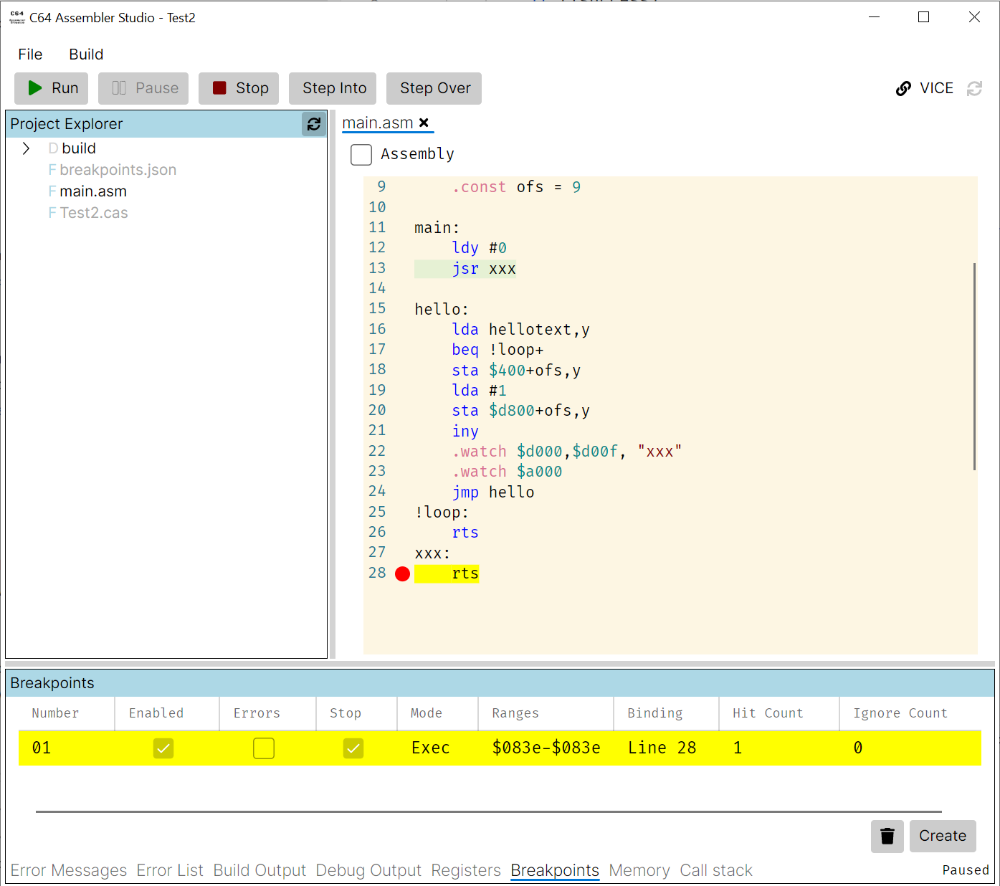

# C64 Assembler Studio
C64 Assembler Studio is a cross-platform .NET based project aiming to create a comprehensive IDE including debugging experience for C64 assembler languages and [VICE emulator](https://vice-emu.sourceforge.io/) for debugging and running assembled programs. [Kick Assembler](https://www.theweb.dk/KickAssembler/) is first assembler supported and embedded in the distribution (no manual installation is required). Others could follow. 

[Avalonia UI](https://docs.avaloniaui.net/) is used for GUI. For communication with VICE it is using my other project [VICE Binary Monitor Bridge for .NET](https://github.com/MihaMarkic/vice-bridge-net). A lot of code is same as in my  read-only debugging studio [Modern VICE PDB monitor](https://github.com/MihaMarkic/modern-vice-pdb-monitor).

 	

## Status
Project is in early preview stage. Which means it works on a simple sample, not polished (both UI and functionality) and with features missing or half-baked.

## Quick Start

See [Docs](docs/quick-start.md).

## Prerequisites
Java should be installed and in the CLI path, so it is found by typing java in the command line. A good candidate is the latest [OpenJDK 22 binaries](https://openjdk.org).

VICE files should be on disk, and it should have enabled binary monitor (at Preferences/Settings, Host/Monitor Enable binary monitor should be checked and pointing to ip4://127.0.0.1:6502).

## TODO (priority)
* Polish UI (low)
* 'Intellisense' (high)
* Fixing edge cases (medium)
* Enhancing/polishing existing features (medium)
* Adding features (low)
* Test on real samples (high-medium) - YOUR SAMPLES WELCOME

## Distribution
For the latest binaries, check [Releases](Releases). There are framework dependent build (required .NET runtime installation), self contained builds (just unpack) and a special Win x64 [scoop](https://scoop.sh) build.

## Installation

Self contained build contain all files necessary to run the application (minus JAVA runtime), while framework dependent require .NET runtime as well.

### Windows
#### From archive
Unpack `C64AssemblerStudio\_selfcontained\_VERSION\_win\_x64.zip` or  `C64AssemblerStudio\_VERSION\_*\_dependent` build.
#### Using scoop

You have to install [scoop](https://scoop.sh).

Before using apps from my [bucket](https://github.com/MihaMarkic/scoop-bucket/), you need to add my bucket: `scoop bucket add mihamarkic https://github.com/MihaMarkic/scoop-bucket`. Once bucket is added, installation and update are trivial.

To install: `scoop install mihamarkic/c64assemblerstudio`

To update: `scoop update c64assemblerstudio` or `scoop update` to update all scoop installed apps.

### Linux
#### From archive
Unpack `C64AssemblerStudio\_selfcontained\_VERSION\_linux\_x64.zip` or  `C64AssemblerStudio\_VERSION\_*\_dependent` build.

### MacOS
Unpack `C64AssemblerStudio\_selfcontained\_VERSION\_osx\_arm64.zip` or  `C64AssemblerStudio\_VERSION\_*\_dependent` build.

## Building from source
Clone this repository somewhere.
In the cloned directory, create binaries subdirectory and copy `KickAssembler.jar` and `KickAss.cfg` files in it.

### Without Retro Debug Data Provider sources

Use Debug or Release configurations. Binaries will be installed through Nuget.

### With Retro Debug Data Provider sources

Clone repository [retro-dbg-data-provider](https://github.com/MihaMarkic/retro-dbg-data-provider) into a sibling directory where this repository has been cloned. Open solution and build.

Use Local Debug configuration.