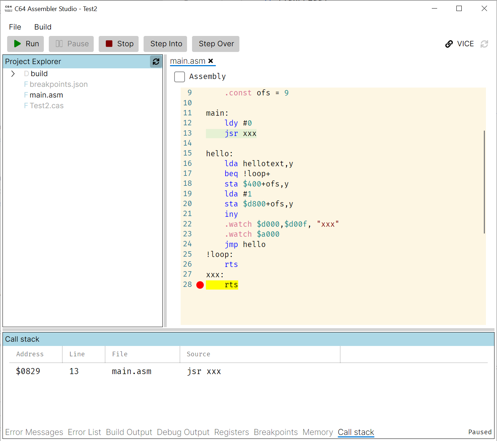
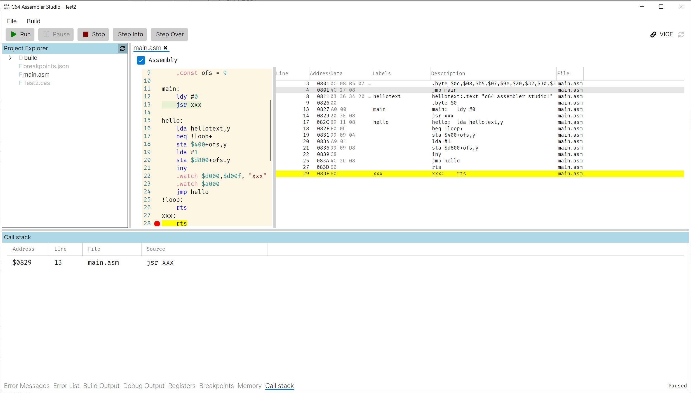

# C-64 Assembler Studio
## Quick Start

### Prerequisites

1. Java should be installed and in the CLI path, so it is found by typing `java` in the command line.
2. VICE files should be on disk and it should have enabled binary monitor (at Preferences/Settings, Host/Monitor Enable binary monitor should be checked and pointing to `ip4://127.0.0.1:6502`).

### Installation

Unzip files found in [Releases](https://github.com/MihaMarkic/C64-Assembler-Studio/releases) into a directory.

### First time running

A settings dialog is presented when path to VICE directory is expected. If VICE files are found in given directory, Valid directory is checked.

<p align="center">
 	
</p>
 Dialog should be closed by clicking `Close` button.

 When no project is loaded, a similar content is displayed:
<p align="center">
 	
</p>

### Creating a new Kick Assembler project

`File/New`, select an empty directory and type in the name of the project (`Test2` in my case). 
Another dialog asks for project name (in case it's different than file name given above). `Close` finalizes the project creation.
Two files will be created - [PROJECTNAME].cas and default main.asm. The later contains sample code that outputs C64 ASSEMBLER STUDIO!.
Upon successful project creation Project Explorer will show both files in project's directory.

### Running the project

**Important**: Make sure no other VICE instance is running otherwise binary monitor will latch to one already running. This will be improved in future. The problem is that (binary) monitor URL within VICE is shared between instances and it can't be changed for a single instance.

Click on `Run` button first builds the project and if successful, starts debugging by first launching and instance of VICE, uploading compiled application and running it.

Kick Assembler output is displayed in Build Output window.

<p align="center">
 	
</p

If everything went well, VICE should display this image:
<p align="center">
 	
</p>

### Breakpoints

There are three types of breakpoints.
1. Line breakpoints - created by clicking in the source line to the right of line number. Click on same spot removes it. These are EXEC breakpoints for all addresses created during assembly for that line.
2. Address breakpoints - created in Breakpoints window using `Create` button. These can be set at any address range and any mode - EXEC, LOAD and STORE.
3. Hardcoded breakpoints and watchpoints (not supported ATM) which are created after successful assembly step before application is run.

Sample unbound breakpoint dialog
<p align="center">
 	
</p>

Breakpoints are displayed in source files right to the line number (only line breakpoints) and in breakpoints window (all breakpoints). Ranges value is determined only after successful assembly step.

<p align="center">
 	
</p>

In the image above, the execution hit line breakpoint - yellow background show the breakpoint hit and source line where execution stopped.

Breakpoints view features also context menu for each breakpoint.

Deleting all breakpoints at once can be done by clicking the trash button in Breakpoints view.

### Syntax errors

When there are syntax errors during assembly step, they are displayed in source files and Error List view.

<p align="center">
 	
</p>

<p align="center">
 	
</p>

Double clicking on error in Error List navigates to line in question in source file.

### Call stack

When application is paused, a call stack is calculated. Note - this is not exact science, as application can manipulate call stack in ways debugger can't understand. Take it as best guess - similar to VICE's backtrace.

<p align="center">
 	
</p>

Note that source line where JSR instruction originated is also highlighted with a light greenish background.

### Byte dump display

When application is running, byte dump content can be displayed next to source line by checking `Assembly` checkbox on top left of source file.

<p align="center">
 	
</p>

Execution address is also highlighted, lines not belonging to source files are grayed out.

### Memory content

IDE keeps track of current and last memory snapshot. A snapshot is taken each time debbuged application is paused either manually or through a breakpoint.

<p align="center">
 	
</p>

Modified bytes since last snapshot are displayed in bold. View can also be filtered for rows containing only modifications by checking `Only Changes` checkbox. Navigating to any address is possible through text entry next to it.

### Writing application

Double click on any .asm file in Project Explorer opens given file.

<p align="center">
 	
</p>

File can be edited freely.

Project Explorer also feature creating new directories and files, removing files but not yet removing directories, renaming files and opening files in explorer.

To add a file or directory, right click anywhere in Project Explorer empty space and pick either `Add/File` or `Add/Directory` menu. Once file is created, it can be open and edited.

<p align="center">
 	
</p>

Only adding .asm files is supported currently.

### <a name="libraries_support"></a>Libraries support

KickAssembler support libraries which are directory with shared .asm files.
Library directories are set at project level settings.
<p align="center">
 	
</p>
There is no limit to libraries count.

The libraries content is available through Project Explorer's `Libraries` node as any other .asm file.
<p align="center">
 	
</p>

Files from library are imported using `#import` or `#importif` preprocessor directives. Note that not all imports to same file are equal as define constants before import can be different, take this code for an example:

```csharp
#import "target.asm"
#define SOMETHING
#import "target.asm"
```

Even though code is referencing the same file, the `target.asm` content could be different due to the define constant.


There is also Code Completion support for referencing files when you try first double quote char or explicitly on CTRL+SPACE.
<p align="center">
 	
</p>

Simple navigation to referenced file can be done using CTRL+LEFT_BUTTON click when cursor is over referenced file name. This way referenced file will be open in correct variation of define constants. See also [Code Completion](#code_completion)

### <a name="imported_file_variations"></a>Imported file variations

See [Libraries support](#libraries_support).

When file is imported using different define constants, a `Symbols` selector drop down is available for selecting variations.

<p align="center">
 	
</p>

### <a name="code_completion"></a>Code completion

Code completion is currently supporting only when importing files. Code completion is triggered either using first double quote after `#import` or `#importif` preprocessor directives or explicitly on CTRL+SPACE when inside referenced file name where text left of cursor is used as search filter.